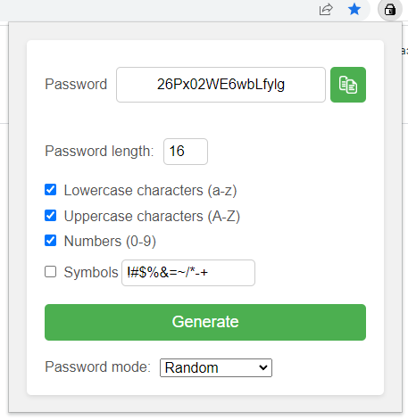

# Random Password Generator

The extension provides a random password generator. This chrome extension was made as a tutorial, both to learn how to create extensions and to practice ai-prompt management.  

## Screenshot
 
